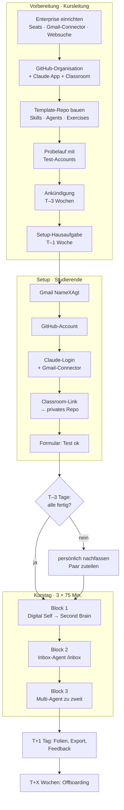
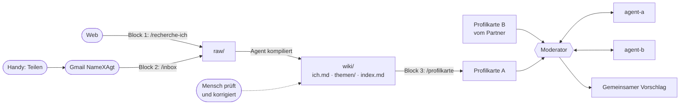
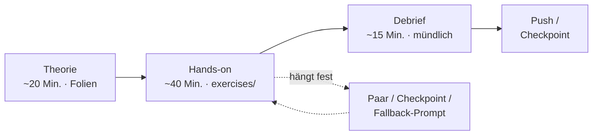

# Drehbuch: Folien, GitHub, To-dos, Journeys und Prozess

Die Diagramme sind in **Mermaid** geschrieben. GitHub zeigt sie direkt als Grafik an. Zum Bearbeiten oder Exportieren als PNG oder SVG kopiert man den Code in https://mermaid.live. Fertige PNGs für die Folien liegen in [`diagramme/`](diagramme/).

---

## 1. Was gehört wohin?

### 1a. Auf die Folien (deine Theorie plus Regie-Folien)
Die Folien sagen **warum**. Anweisungen zum Kopieren stehen nicht darauf.

| Block | Theorie-Folien | Regie-Folien |
|---|---|---|
| **Start** | Titel, Agenda "3 Blöcke, 1 persönlicher Agent" | **QR-Code** zu claude.ai/code und zum Classroom-Link; WLAN-Daten |
| **1** | LLM vs. Agent · Agent Loop (Wahrnehmen, Planen, Handeln, Beobachten) · Workflow vs. Agent · Halluzination und Verifikation | "Öffnen Sie `exercises/block1.md`" · Timer 40 Min. · Debrief-Frage: "Wo hat Ihr Agent sich geirrt?" · **"Jetzt pushen"** |
| **2** | Tools, MCP und Connectors · Memory (Second Brain als Langzeitgedächtnis) · Permissions und Autonomiestufen · Chat vs. Agent vs. Routine | **Zu Beginn:** "Schicken Sie jetzt 2–3 Links vom Handy an Ihre `…XAgt`-Adresse" · "Öffnen Sie `exercises/block2.md`" · Checkpoint `block2-start` |
| **3** | Multi-Agent-Patterns (Orchestrator-Worker, Evaluator-Optimizer, Parallelisierung) · Kosten und Risiken · Governance: Wer haftet, was darf der Agent preisgeben? | "Bilden Sie Paare" · **Szenario erst jetzt zeigen** · "Öffnen Sie `exercises/block3.md`" · Checkpoint `block3-start` |
| **Ende** | Zusammenfassung · Wie geht es weiter (Obsidian, Routine) · Feedback-QR | – |

### 1b. In die gemeinsame GitHub-Kurs-Organisation
Das hier ist das **Template-Repo**, das GitHub Classroom an alle verteilt. Es ist *nicht* dieses Planungs-Repo.

| Datei bzw. Ordner | Zweck | Status |
|---|---|---|
| `README.md` | 5-Zeilen-Anleitung: "Session starten, `exercises/` öffnen" | zu bauen |
| `CLAUDE.md` | Regeln für den Agenten: Wiki-Struktur nach Karpathy, Quellen nennen, Schritte erklären, Deutsch | zu bauen |
| `.claude/settings.json` | vorab erlaubte Befehle, damit weniger Rückfragen kommen | zu bauen |
| `.claude/skills/recherche-ich/` | Block 1 | zu bauen |
| `.claude/skills/inbox/` | Block 2, funktioniert auch ohne YouTube-Transkript | zu bauen |
| `.claude/skills/profilkarte/` | Block 3 | zu bauen |
| `.claude/agents/agent-a.md`, `agent-b.md`, `moderator.md` | Block 3 | zu bauen |
| `raw/`, `wiki/index.md` | leeres Second Brain | zu bauen |
| `exercises/block1.md` … `block3.md` | Aufgaben, Prompts zum Kopieren, Fallbacks | zu bauen |
| Branches `block2-start`, `block3-start` | Checkpoints für Nachzügler | zu bauen |

**Nicht** ins Kurs-GitHub gehören: die Folien (die gehen nach dem Kurs über die Lernplattform raus), die Planungsdokumente in diesem Repo und die Daten der Studierenden (jede Person hat ihr eigenes privates Repo).

### 1c. Was gemacht werden muss (Reihenfolge)
1. **Admin:** Enterprise-Seats, Gmail-Connector, Websuche, Netzwerkfreigabe für YouTube ([`admin-checkliste.md`](admin-checkliste.md))
2. **GitHub:** Kurs-Organisation anlegen, Claude GitHub App installieren, Classroom einrichten
3. **Template bauen** (1b) und hochladen
4. **Probelauf** mit 2–3 Test-Accounts durch alle 3 Blöcke
5. **Folien ergänzen** um die Regie-Folien aus 1a
6. **Kommunikation** nach [`kommunikationsplan.md`](kommunikationsplan.md) verschicken

---

## 2. Szenario: Die Journey einer Studentin

**Persona: Sandra, 42, Head of Controlling bei einer Versicherung.** Kennt Python aus einem Data-Analytics-Modul, war aber nie in einem Terminal. Hat einen Firmen-Laptop.

| Wann | Was Sandra erlebt | Mögliches Problem | Auffangnetz |
|---|---|---|---|
| **T–3 Wochen** | Liest die Ankündigung: "Ich baue meinen eigenen Agenten, ohne Programmieren." Ist neugierig, bei der Selbstrecherche aber etwas skeptisch. | Datenschutzbedenken | Der Hinweis erklärt, dass die Recherche freiwillig ist, mit CV-Alternative und privatem Repo |
| **T–1 Woche** | Arbeitet die Setup-Hausaufgabe ab: legt `sandrakellerxagt@gmail.com` an, erstellt einen GitHub-Account, meldet sich mit HSG-Login bei Claude an. | Verbindet den Gmail-Connector versehentlich mit ihrer privaten Adresse | Die Anleitung sagt ausdrücklich: "den `…XAgt`-Account wählen." Der Test-Prompt deckt den Fehler auf |
| **T–3 Tage** | Formular ausgefüllt, der Test hat funktioniert. | – | – |
| **Block 1** | Scannt den QR-Code, und die Session läuft. Nach der Theorie zum Agent Loop kopiert sie den Prompt aus `block1.md`. Der Agent findet eine andere Sandra Keller, eine Sportlerin. Sie lacht und korrigiert es. Ihr `wiki/ich.md` entsteht. | Firmen-Laptop blockiert claude.ai | Sie arbeitet auf dem Handy oder mit einem Partner |
| **Pause** | Scrollt auf LinkedIn und teilt ein Video zu KI im Controlling an ihre `…XAgt`-Adresse. | – | – |
| **Block 2** | Führt `/inbox` aus. Der Agent fasst das Video und zwei Artikel zusammen und legt `wiki/themen/ki-controlling.md` an, mit Verlinkung auf `ich.md`. **Aha-Moment:** "Der kennt meinen Kontext." | Kein YouTube-Transkript | Der Skill nutzt Titel und Beschreibung und sagt das transparent |
| **Block 3** | Bildet ein Paar mit Marco (Produktmanager in der Industrie). Beide erzeugen `/profilkarte` und tauschen sie aus. Die Agenten diskutieren, der Moderator schlägt vor: "Gemeinsames Pilotprojekt: KI-gestütztes Forecasting in der Supply Chain." | Marco ist beim Checkpoint zurück | Er startet von `block3-start` |
| **Debrief** | Diskutiert: "Darf mein Agent meine Gehaltsvorstellung verraten?" | – | – |
| **T+1 Tag** | Bekommt die Folien und eine Export-Anleitung. Öffnet ihr Wiki zu Hause in Obsidian und lässt `/inbox` als Routine weiterlaufen. | – | – |

---

## 3. Szenario: Deine Journey als Kursleitung

| Wann | Was du tust | Worauf du achtest |
|---|---|---|
| **T–4 Wochen** | Admin-Checkliste abarbeiten, GitHub-Organisation und Classroom anlegen, Template hochladen | Die Claude GitHub App auf der **Organisation** installieren, sonst gibt es den 403-Fehler |
| **T–3 Wochen** | Ankündigung verschicken. **Probelauf** mit Test-Accounts | Im Probelauf alles testen: Gmail-Connector, Websuche, YouTube |
| **T–1 Woche** | Setup-Hausaufgabe verschicken | Frist für das Formular setzen |
| **T–3 Tage** | Formular auswerten: z.B. 24 fertig, 6 offen. Die 6 persönlich anschreiben und Paare vorplanen | Wer bis zum Kurstag nicht fertig ist, arbeitet mit einer Partnerin oder einem Partner |
| **Kurstag, 30 Min. vorher** | Beamer, WLAN und die eigene Demo-Session testen; die Fallback-Demo bereithalten | Zweiten Browser mit dem Test-Account offen haben |
| **Block 1, 0–10 Min.** | QR-Code zeigen: "Alle schreiben 'Hallo'." Handzeichen einholen, wer nicht läuft | Hängt jemand länger als 5 Min. fest, gleich ins Paar schicken |
| **Block 1, Hands-on** | Durch den Raum gehen und Halluzinationen *sammeln*, als Material für den Debrief | Nicht selbst die Tastatur übernehmen |
| **Block 1, Ende** | "Jetzt pushen" | Kurze Kontrolle per Handzeichen |
| **Block 2, Start** | "Jetzt 2–3 Links vom Handy schicken", dann die Theorie | Die Inbox füllt sich, während du sprichst |
| **Block 2, Hands-on** | Ein gutes Beispiel live am Beamer zeigen | Fehlt ein Transkript: "Das ist ein Feature, kein Bug. Agenten müssen mit Lücken umgehen." |
| **Block 3, Start** | Paare bilden (Branchen mischen), erst jetzt das Szenario zeigen | Ungerade Zahl: eine Dreiergruppe bilden |
| **Block 3, Debrief** | Die besten Vorschläge von 2–3 Paaren vorstellen lassen, dann über Governance diskutieren | Exec-Perspektive: Haftung, Datenschutz, Kosten |
| **T+1 Tag** | Nachbereitung verschicken: Folien, Export-Anleitung, Feedback | Das Offboarding-Datum nennen |
| **T+X Wochen** | Seats entziehen, Repos archivieren | Vorher daran erinnern, das Second Brain zu exportieren |

---

## 4. Prozessdiagramme

### 4a. Gesamtprozess: wer wann was macht

### 4b. Datenfluss im durchgehenden Case

### 4c. Ablauf eines Blocks

